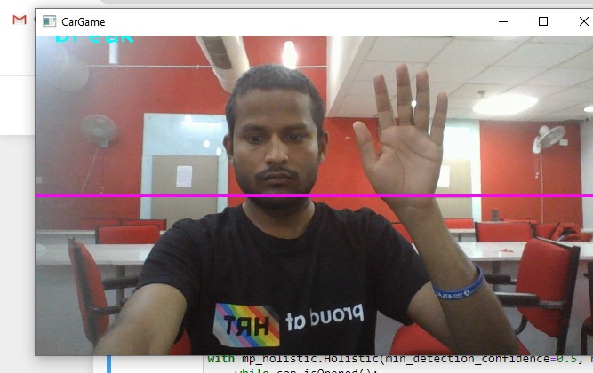
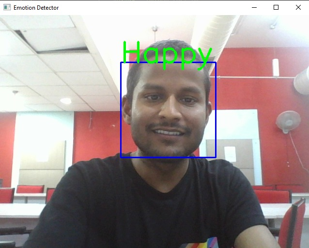
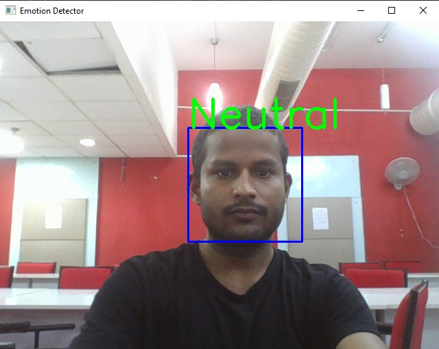
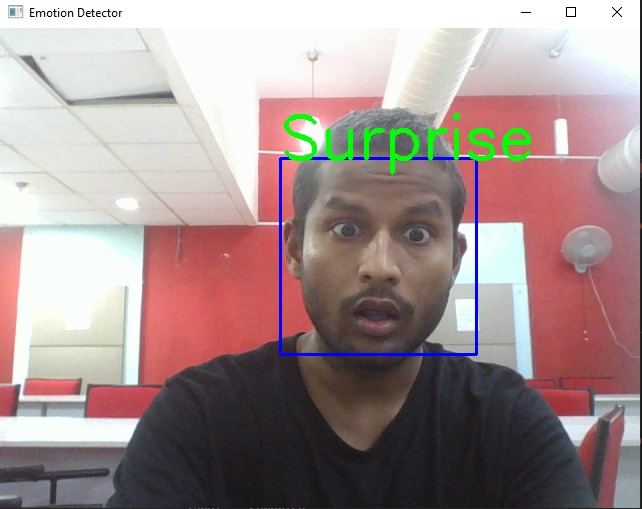
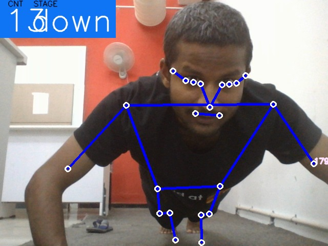
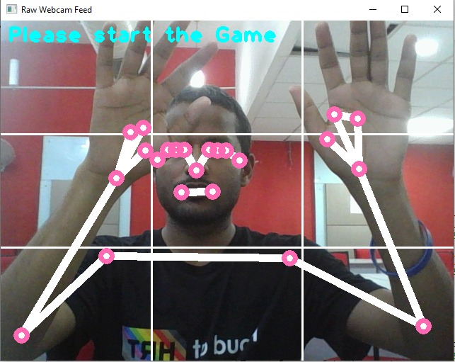
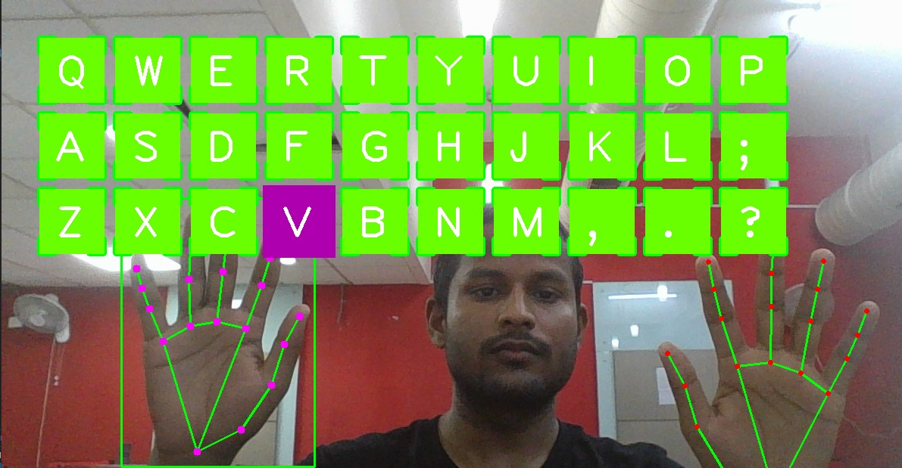
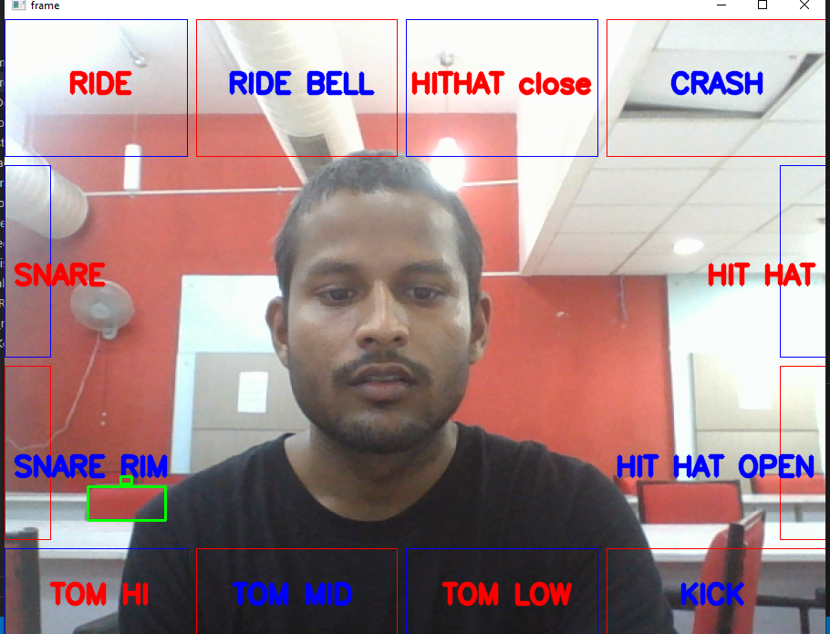

# **Computer Vision**
this readme file contains projects and learning material for openCv.

# Requirments :
* Install Python 3.7.6
    * Install using link :
        * For Window user : https://www.python.org/ftp/python/3.7.6/python-3.7.6-amd64.exe
        * For Mac User  : https://www.python.org/ftp/python/3.7.6/python-3.7.6-macosx10.9.pkg
* Install Jupyter Notebook
    * Run this Command in Command prompt :
        * pip install jupyter notebook
* Install Mediapipe
    * Run the following command in jupyter notebook cell
         * !pip install mediapipe --user
* install pydirectinput (for Hill Climb and temple run automation)
    * Run the command in jupyter notebook cell :
         * !pip install pydirectinput

**-------------------------------------------------------------------------------------------------------------------**
* # Learning Material for Computer Vision :
## This folder contains four files

  
   * **1. CV Notes 1** : [computer vision lecture 01](https://github.com/Ramanand-Yadav/ComputerVisionProjects/blob/main/LecturesComputerVision/CVNotes1.pdf)
   * **2. Cv Notes 2** : [Computer vision Lecture 02](https://github.com/Ramanand-Yadav/ComputerVisionProjects/blob/main/LecturesComputerVision/CVNotes2.pdf) 
* **3. [OpenCv and Mediapipe](https://github.com/Ramanand-Yadav/ComputerVisionProjects/blob/main/LecturesComputerVision/OpenCV%20And%20Mediapipe.ipynb)**  This is the code if anyone wants to learn open cv and mediapipe from scratch.

* **4. [Hill Climb Automation](https://github.com/Ramanand-Yadav/ComputerVisionProjects/blob/main/LecturesComputerVision/Hill%20Climb%20Automation%20Game.ipynb)**  : 
This is the project of Computer Vision in which both openCv and Mediapipe is used.

* Open Jupyter Notebook and you can run the project

**output**
          
          
         
   

        
  
**-----------------------------------------------------------------------------------------------------------------**
  

* # [Emotion Detection : ](https://github.com/Ramanand-Yadav/ComputerVisionProjects/tree/main/EmotionDetection)
  ## This folder contains Four files
   
   * **Emotion_Detection.h5** : This is the model which is already trained.
   * **haarcascade_frontalface_default.xml** : This file Contain function that are needed to clasify face.
   * **Test.py**  : This is the file which needed to be run in order to detect your expression.
   * **Train.py** : If you want to train the model on your own dataset. So you can give your data of face by using this file.

    Now To run this project on pretrained model run the test file By using the following commands :

    * windows user  : python test.py
    * linux user  : python3 test.py
    
**some output pic**

Happy 😀
  

  

Neutral 🙂
  

  
    
Surprise 😮

  

  

**-------------------------------------------------------------------------------------------------------------------**
* # [Gym Assistant : ](https://github.com/Ramanand-Yadav/ComputerVisionProjects/tree/main/GymAssistant)
    ## This is the ipynb file which needed to be run in jupyter notebook to check your push - ups count and up down counts.

    * Open jupyter notebook and run the project.

    **output**

    Gym 😮
          
          
**-------------------------------------------------------------------------------------------------------------------**

* # [TempleRun Automation  : ](https://github.com/Ramanand-Yadav/ComputerVisionProjects/tree/main/templeRun)
    ## This is the extendsion of automation of hill climb game. In this the populated temple run game is being automated.

    * Open jupyter notebook and run the program.

    **output**

      

  

**-------------------------------------------------------------------------------------------------------------------**
* # [Virtual Keyboard  : ](https://github.com/Ramanand-Yadav/ComputerVisionProjects/tree/main/VirtualKeyboard) 
    ##  Now a days technology is faster and wireless so I came up with the notion of capturing keys without touching them and showed our virtual keyboard.

    * open jupyter notebook and run the program.

    **output**

      

  

**-----------------------------------------------------------------------------------------------------------------**
    
* # [Air Drum : ](https://github.com/Ramanand-Yadav/ComputerVisionProjects/tree/main/AirDrum) 
*    ## In this project, I use OpenCV to create a virtual drum set using fundamental computer vision techniques.

* Open jupyter notebook and run the program.

`Blue and Red sticks are needed because I have used a detection window that would detect the color Blue and red.`

**output**

  

  

